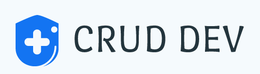
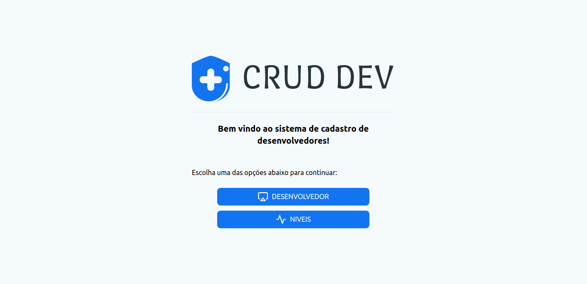
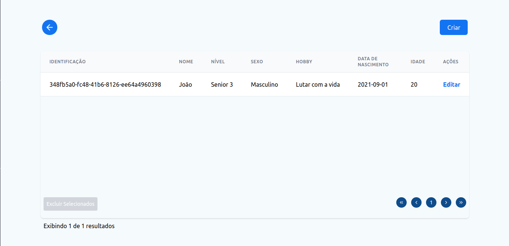
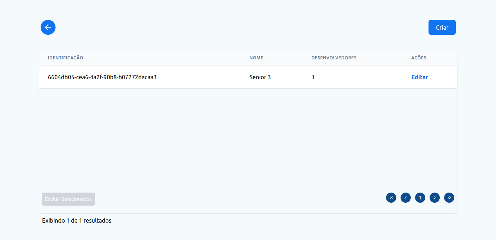
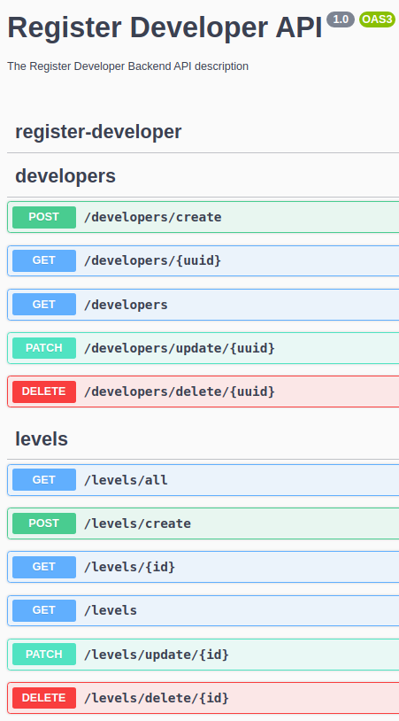

<p align="center">
  <a href="http://nestjs.com/" target="blank"></a>
</p>

<p align="center">Cadastro de desenvolvedores e seus níveis</p>

## Notas

> Não deu tempo para deixar o projeto em um servidor como o heroku, mas deixo aqui um projetinho muito massa para referência (Fiz ele em um curso mas adicionei uma serie de features, como o modo escuro e responsividade além de ter feito ele com meu querido TailwindCSS 😌 )
> <br />
> <a href="https://letmeask-true.web.app/">Teasker</a>

> Pra validação eu preferiria ter usado o UnForm com o Yup mas acabei tentando algo diferente com o React Hook Form não ficou muito bom 😞, mas deixo aqui um projeto onde utilizei esse tipo de validação 😏 (Esse é um projeto mobile, mas é usando a mesma biblioteca e os conceitos são quase os mesmos. 😎)
> <br />
> <a href="https://github.com/carloseduardodb/crud-register-teacher-react-native">React Native Register Teacher</a>

## O que foi divertido fazer 🥳

> Estava tentando integrar o React Table com paginação usando o servidor e foi meio chato integrar mas ocorreu tudo bem.

## Tecnologias utilizadas

### Frontend

- TypeScript
- React
- React Hook Form
- Toastify
- React Table (Paginação do lado servidor)
- React Router Dom
- React Icons
- Axios
- Context API, useMemo, useCallBack

### Backend

- TypeScript
- Nestjs
- PostgreSQL
- TypeORM
- Swagger (Documentação da API)
- Jest - Testes Unitários (Apenas casos de sucesso ( por enquanto 😋 ))
- Alguns princípios de DDD/TDD

<br />

## Ações criadas

### Nível

- Adicionar
- Remover
- Atualizar
- Listar um
- Listar todos (Paginado)
- Listar todos (Sem paginação / Para exibição no cadastro de desenvolvedor)
- Exclusão em Massa

### Desenvolvedor

- Adicionar
- Remover
- Atualizar
- Listar um
- Listar todos (Paginado)
- Exclusão em massa

## Telas do projeto

- Inicio
  <br />
  

- Gerenciar desenvolvedores
  <br />
  

- Gerenciar níveis
  <br />
  

- Listagem dos endpoints do Swagger
  <br />
  

## Instalação (Comandos testados apenas no linux)

<p>
    Clone o repositório em sua maquina
</p>

```bash
$ git clone https://github.com/carloseduardodb/register-developer.git
```

<p>
    Acesse a pagina do projeto
</p>

```bash
$ cd register-developer
```

### Backend

<p> É necessário a instalação global do <a href="https://www.npmjs.com/package/ts-node">ts-node</a></p>
<p>
    Entre na pasta do projeto
</p>

```bash
$ cd register-developer-backend
```

> Configure o banco de dados no arquivo register-developer-backend/src/ormconfig.ts por padrão estou utilizando o Postgresql

> Crie um banco de dados com o nome pg_data

<p>
    Rode o comando abaixo
</p>

```bash
$ yarn install && yarn start:dev && yarn test:watch
```

> O projeto estará disponível em localhost:3000

> A documentação da api estará disponível em localhost:3000/api

### Frontend

<p>
    Entre na pasta do projeto
</p>

```bash
$ cd register-developer-frontend
```

<p>
    Rode o comando abaixo
</p>

```bash
$ yarn install && yarn start
```

> O projeto estará disponível em localhost:3001

## Entre em contato

- Autor - [Carlos Eduardo Dias Batista](https://portfolio-carlos-eduardo-dias-batista.vercel.app/)
- Website do Framework - [https://nestjs.com](https://nestjs.com/)
- Linkedin - [@carlos-eduardo-batista-26a574120](https://www.linkedin.com/in/carlos-eduardo-batista-26a574120/)

## License

Register Developer is [MIT licensed](LICENSE).
